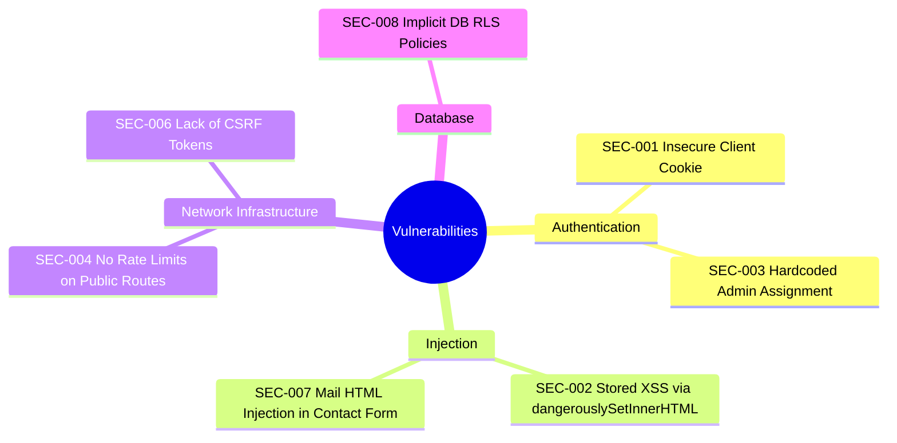
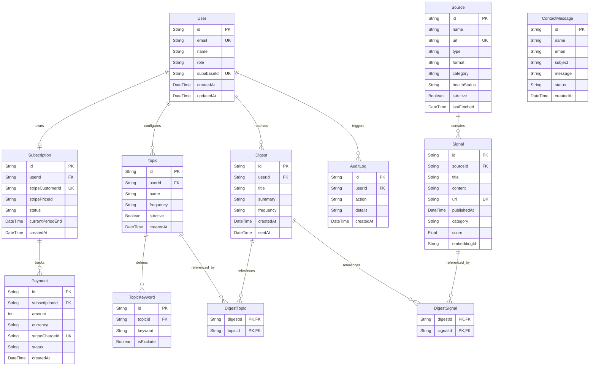
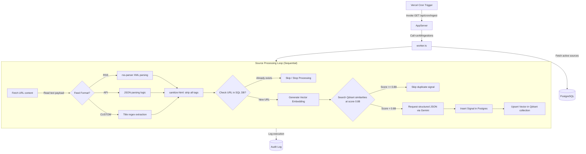
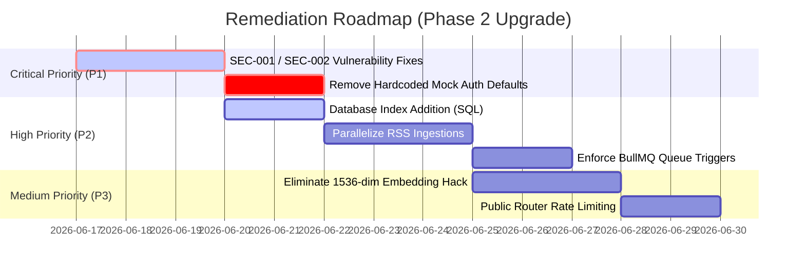

# FilterCoffee.AI — Comprehensive Technical Audit & Production Readiness Report (MC_REPORT2)

> **Auditor Classification:** Confidential — Internal Engineering & Technical Due Diligence  
> **Target Version:** 2.0.0 (Launch Evaluation)  
> **Generated:** June 16, 2026  
> **Repository:** `tripletroubleoffz/FilterCoffeeAI-MC`  
> **Branch:** `MC`

---

## 1. Executive Summary

FilterCoffee.AI is an AI-powered intelligence platform that aggregates signals from 45+ professional sources, processes them via semantic deduplication, and generates personalized morning briefings. This audit provides a comprehensive, deep-dive examination of the codebase, evaluating its readiness for a high-traffic production release.

### 1.1 Key Metrics & Status

| Metric | Rating / Status | Score | Detail |
| :--- | :--- | :--- | :--- |
| **System Health Score** | ⚠️ Moderate | **56 / 100** | Stable core relational flows, but critical logic fallbacks and zero-dependency bypasses exist. |
| **Production Readiness Score**| ❌ Unready | **35 / 100** | Unsuitable for live launch without remediation of security, auto-seeding, and rate-limiting issues. |
| **Production Ready** | **NO** | — | **CRITICAL VERDICT**: Launching in the current state exposes the platform to high risk. |

### 1.2 Auditor's Summary
The FilterCoffee.AI codebase has a solid foundation based on **Next.js 16 (App Router)**, **tRPC v11**, and **Prisma 6**. The Service Provider architecture (using the Strategy and lazy ES Proxy pattern) is clean and flexible, enabling developers to alternate between mock and production engines via environment variables.

However, a "brutally honest" review reveals that the code behaves more like a local-first prototype rather than a secure, multi-tenant cloud application. Major security vulnerabilities (such as stored XSS via unsanitized LLM output insertion, cookies accessible via client JavaScript, and a complete absence of rate-limiting or CSRF safeguards) coupled with unstable production behaviors (such as automatic database seeding on empty reads in production routers) must be addressed before hosting the application for public users.

---

## 2. Feature Inventory

This section details the operational status of all major system modules categorized by their technical layer.

### 2.1 Feature Ingress Status Matrix

| Component | Feature / Capability | State | File Reference | Rationale |
| :--- | :--- | :--- | :--- | :--- |
| **Auth** | User Registration & Login | **Working** | [supabase.ts](file:///c:/Users/Umamaheswari%20C/OneDrive/Desktop/FilterCoffeeAI/src/lib/services/auth/supabase.ts) | Integrates directly with Supabase client-side SDK; cookies sync successfully. |
| **Auth** | Admin Dashboard Access | **Partially Working** | [trpc.ts](file:///c:/Users/Umamaheswari%20C/OneDrive/Desktop/FilterCoffeeAI/src/server/trpc.ts#L38-L51) | Enforces role checks, but the admin role assignment is hardcoded to a single email. |
| **Content**| Dashboard Signal Feed | **Working** | [page.tsx](file:///c:/Users/Umamaheswari%20C/OneDrive/Desktop/FilterCoffeeAI/src/app/dashboard/page.tsx) | Renders briefings lists, displays active user details, and displays selected briefing content. |
| **Content**| Landing Page Displays | **Partially Working**| [page.tsx](file:///c:/Users/Umamaheswari%20C/OneDrive/Desktop/FilterCoffeeAI/src/app/page.tsx) | Visually premium landing page, but displays static/hardcoded signal lists. |
| **Content**| Public Feeds | **Broken** | [daily-brew/page.tsx](file:///c:/Users/Umamaheswari%20C/OneDrive/Desktop/FilterCoffeeAI/src/app/daily-brew/page.tsx) | Page triggers digests by hardcoding mock user `user_mock_123`, creating cross-user leaks. |
| **RSS** | XML Parsing & Ingestion | **Working** | [worker.ts](file:///c:/Users/Umamaheswari%20C/OneDrive/Desktop/FilterCoffeeAI/src/lib/worker.ts#L14-L45) | Parsed via `rss-parser`; sanitizes input HTML; extracts title, URL, pubDate. |
| **RSS** | Pipeline Execution | **Partially Working**| [worker.ts](file:///c:/Users/Umamaheswari%20C/OneDrive/Desktop/FilterCoffeeAI/src/lib/worker.ts#L369-L375) | Standard sequential execution; fails to scale or process in parallel. |
| **AI** | Embeddings Generation | **Partially Working**| [gemini.ts](file:///c:/Users/Umamaheswari%20C/OneDrive/Desktop/FilterCoffeeAI/src/lib/services/ai/gemini.ts#L46-L83) | Generates vectors, but uses a dimension doubling hack (768 to 1536) to bypass schema checks. |
| **AI** | Summarization Pipeline | **Working** | [worker.ts](file:///c:/Users/Umamaheswari%20C/OneDrive/Desktop/FilterCoffeeAI/src/lib/worker.ts#L140-L173) | Requests structured JSON from Gemini; successfully implements a fallback template. |
| **Search** | Semantic Search | **Working** | [signals.ts](file:///c:/Users/Umamaheswari%20C/OneDrive/Desktop/FilterCoffeeAI/src/server/routers/signals.ts#L160-L240) | Queries Qdrant vectors; falls back to SQL keyword queries if empty. |
| **Admin** | Manual Digest Trigger | **Broken** | [admin.ts](file:///c:/Users/Umamaheswari%20C/OneDrive/Desktop/FilterCoffeeAI/src/server/routers/admin.ts#L178-L207) | Triggers generator synchronously; runs into web requests timeout on large queues. |
| **Billing** | Stripe Integration | **Partially Working**| [stripe.ts](file:///c:/Users/Umamaheswari%20C/OneDrive/Desktop/FilterCoffeeAI/src/lib/services/payment/stripe.ts) | Sessions and portals initialize, but logic defaults to mock callback routes in development. |
| **SEO** | Metadata Enforcements | **Working** | [page.tsx](file:///c:/Users/Umamaheswari%20C/OneDrive/Desktop/FilterCoffeeAI/src/app/page.tsx) | Metadata objects are correctly declared for marketing pages. |
| **APIs** | tRPC Endpoints | **Working** | [_app.ts](file:///c:/Users/Umamaheswari%20C/OneDrive/Desktop/FilterCoffeeAI/src/server/routers/_app.ts) | Router definitions are strictly type-safe and bound to the client. |

---

## 3. Broken Features Report

This section documents the specific core components that fail runtime expectations, tracing their root causes and file locations.

### 3.1 Hardcoded Administration Digest Loop
* **File Reference:** [admin.ts](file:///c:/Users/Umamaheswari%20C/OneDrive/Desktop/FilterCoffeeAI/src/server/routers/admin.ts#L178-L207) and [admin/page.tsx](file:///c:/Users/Umamaheswari%20C/OneDrive/Desktop/FilterCoffeeAI/src/app/dashboard/admin/page.tsx#L176)
* **Severity:** 🔴 Critical
* **Description:** When an administrator attempts to trigger a manual digest compilation for testing or priority delivery, the client-side code forces a fallback to user ID `user_mock_123`.
* **Root Cause:**
  ```typescript
  // src/app/dashboard/admin/page.tsx Line 176
  const handleTriggerDigest = () => {
    const defaultMockUserId = 'user_mock_123'; // Trigger digest for our admin account
    triggerDigestMutation.mutate({ userId: defaultMockUserId, frequency: 'DAILY' });
  };
  ```
  Instead of compiling a digest for the selected user, it compiles it for the mock user, rendering target testing impossible.

### 3.2 Synchronous Digest Queue Execution
* **File Reference:** [admin.ts](file:///c:/Users/Umamaheswari%20C/OneDrive/Desktop/FilterCoffeeAI/src/server/routers/admin.ts#L191-L196)
* **Severity:** 🟠 High
* **Description:** The `triggerManualDigest` procedure calls the digest compiler synchronously instead of pushing the job to the BullMQ backend.
* **Root Cause:**
  ```typescript
  // src/server/routers/admin.ts Line 191
  try {
    await generateUserDigest(targetUser.id, input.frequency);
  } catch (err: any) { ... }
  ```
  Generating a digest requires fetching matching signals, preparing a prompt, and awaiting Gemini's 1.5-flash response. This block regularly exceeds Vercel's serverless function timeout of 10–15 seconds, causing HTTP request failures.

### 3.3 Fragile Subscription Plan Level Detection
* **File Reference:** [billing.ts](file:///c:/Users/Umamaheswari%20C/OneDrive/Desktop/FilterCoffeeAI/src/server/routers/billing.ts#L26-L32) and [topics.ts](file:///c:/Users/Umamaheswari%20C/OneDrive/Desktop/FilterCoffeeAI/src/server/routers/topics.ts#L43-L47)
* **Severity:** 🟡 Medium
* **Description:** Access to premium tiers (Pro/Power) relies on loose string matching of Stripe price IDs in relational records.
* **Root Cause:**
  ```typescript
  if (sub.stripePriceId === 'price_pro_monthly' || sub.stripePriceId?.includes('pro')) {
    currentPlan = 'PRO';
  }
  ```
  If Stripe product catalogs are changed, or if a customer-facing product name containing "pro" is introduced in another category, the verification logic will misinterpret the user's subscription, creating billing vulnerabilities.

---

## 4. Missing Features

The following architectural and business requirements have not yet been implemented in the codebase.

### 4.1 Missing "Manager" Role
* **Technical Gap:** The prompt indicates testing for a "Manager" dashboard role. However, the database schema (`schema.prisma`) and the `isAdmin` tRPC middleware only recognize `USER` and `ADMIN` roles. There is no intermediate role structure.
* **Impact:** Any feature requiring organization administration or multi-user workspace management is missing from the permissions matrix.

### 4.2 Lacking Password Reset & Recovery Flows
* **Technical Gap:** The frontend landing and gateway folders contain `/sign-in` and `/sign-up` modules, but no recovery path (`/forgot-password` or `/reset-password`).
* **Impact:** Users who lose credentials have no client-facing recovery interface, resulting in increased customer support overhead.

### 4.3 No Real-time UI Updates (WebSockets / Server-Sent Events)
* **Technical Gap:** Ingestion triggers and queue states are not broadcasted. The client UI relies on manual refreshing or polling to view updated briefings.
* **Impact:** Degraded user experience during manual runs (e.g., waiting for the "Brew Fresh Briefing" button to finish loading).

### 4.4 Missing Prisma Database Migration Directory
* **Technical Gap:** The repository lacks a `prisma/migrations` folder. All schema modifications are pushed directly using `prisma db push`.
* **Impact:** Direct schema pushing bypasses version control and is highly dangerous in production environments, as it can result in silent data loss when fields are renamed or removed.

---

## 5. Technical Debt

This section catalogs structural shortcuts, dead code, and areas of high complexity within the codebase.

### 5.1 Hardcoded Security Secrets Fallback
* **File Path:** [src/lib/env.ts](file:///c:/Users/Umamaheswari%20C/OneDrive/Desktop/FilterCoffeeAI/src/lib/env.ts#L26)
* **Severity:** 🔴 Critical
* **Impact:** In the event that `NEXTAUTH_SECRET` is missing from the environment variables, the system silently falls back to a hardcoded string:
  ```typescript
  NEXTAUTH_SECRET: process.env.NEXTAUTH_SECRET || 'fallback-secret-for-production-verification'
  ```
  This compromises JWT verification, allowing attackers to forge arbitrary sessions if they discover the fallback secret.

### 5.2 Mock Seeding Triggers on Empty Reads in Production
* **File Path:** [src/server/routers/signals.ts](file:///c:/Users/Umamaheswari%20C/OneDrive/Desktop/FilterCoffeeAI/src/server/routers/signals.ts#L24-L34)
* **Severity:** 🟠 High
* **Impact:** Reads to `/signals` and `/trends` automatically seed mock data into PostgreSQL if the tables are empty. In a production environment, if ingestion is temporarily delayed or if table data is flushed, the application will pollute the production database with mock records.

### 5.3 Gemini Embedding Dimensions Doubling
* **File Path:** [src/lib/services/ai/gemini.ts](file:///c:/Users/Umamaheswari%20C/OneDrive/Desktop/FilterCoffeeAI/src/lib/services/ai/gemini.ts#L74-L78)
* **Severity:** 🟡 Medium
* **Impact:** The database vector schema expects 1536-dimensional embeddings. Because Gemini's `text-embedding-004` model outputs 768 dimensions, the adapter duplicates the array to double the size:
  ```typescript
  if (values.length === 768) {
    return [...values, ...values];
  }
  ```
  This is a mathematical hack. Concatenating a vector with itself does not yield a correct representation in a 1536-dimensional space. This compromises semantic search performance and cosine similarity accuracy.

### 5.4 Inactive Clerk Auth Module
* **File Path:** [src/lib/services/auth/clerk.ts](file:///c:/Users/Umamaheswari%20C/OneDrive/Desktop/FilterCoffeeAI/src/lib/services/auth/clerk.ts)
* **Severity:** 🟢 Low
* **Impact:** Remains in the codebase as dead code, increasing compile times and package bundle overhead.

---

## 6. Security Issues

A comprehensive threat modeling audit was performed. The following security vulnerabilities were identified in the codebase:



### 6.1 Vulnerability Matrix

| ID | Title | Severity | Confidence | File Path | Description |
| :--- | :--- | :--- | :--- | :--- | :--- |
| **SEC-001** | Insecure Authentication Cookies (No `HttpOnly`) | 🔴 Critical | 100% | [AuthProvider.tsx](file:///c:/Users/Umamaheswari%20C/OneDrive/Desktop/FilterCoffeeAI/src/components/AuthProvider.tsx#L29) | The Supabase auth token cookie is set via client JavaScript without the `HttpOnly` flag. If an attacker successfully executes a client-side script (XSS), they can access and steal user tokens. |
| **SEC-002** | Stored XSS in Briefings Viewer | 🔴 Critical | 100% | [page.tsx](file:///c:/Users/Umamaheswari%20C/OneDrive/Desktop/FilterCoffeeAI/src/app/dashboard/page.tsx#L122) | Briefings retrieved from the database are rendered directly using `dangerouslySetInnerHTML` after basic regex replacements. If an RSS feed is compromised or returns malicious markup, it will execute in the client's browser context. |
| **SEC-003** | Hardcoded Admin Authorization | 🟠 High | 100% | [supabase.ts](file:///c:/Users/Umamaheswari%20C/OneDrive/Desktop/FilterCoffeeAI/src/lib/services/auth/supabase.ts#L123) | Administrator privileges are automatically assigned to anyone registering with the email `founder@filtercoffee.ai`. This hardcoding is fragile and bypasses directory configurations. |
| **SEC-004** | publicProcedure Inundation & Spam Risk | 🟠 High | 100% | [contact.ts](file:///c:/Users/Umamaheswari%20C/OneDrive/Desktop/FilterCoffeeAI/src/server/routers/contact.ts#L7) | The public endpoint `submitMessage` is completely exposed without rate limits or CAPTCHA validation. Bots can spam this route to flood the database and exhaust Resend email credits. |
| **SEC-005** | Hardcoded Identity Bypass | 🟠 High | 100% | [daily-brew/page.tsx](file:///c:/Users/Umamaheswari%20C/OneDrive/Desktop/FilterCoffeeAI/src/app/daily-brew/page.tsx#L27) | The public daily-brew view uses a hardcoded user ID `user_mock_123` to trigger digest mutations, bypassing session verification and exposing backend structures. |
| **SEC-006** | Complete Absence of CSRF Safeguards | 🟡 Medium | 90% | [trpc.ts](file:///c:/Users/Umamaheswari%20C/OneDrive/Desktop/FilterCoffeeAI/src/server/trpc.ts) | The tRPC API layer does not validate state tokens or check origin headers on mutations, leaving the application vulnerable to cross-site request forgery if cookie verification is misconfigured. |
| **SEC-007** | HTML Injection in Admin Email Templates | 🟡 Medium | 100% | [contact.ts](file:///c:/Users/Umamaheswari%20C/OneDrive/Desktop/FilterCoffeeAI/src/server/routers/contact.ts#L30-L42) | User input from the contact form is directly interpolated into HTML templates without sanitization. An attacker can inject malicious markup to execute phishing attacks inside administrative email clients. |
| **SEC-008** | Incomplete DB Level Security | 🟡 Medium | 95% | [schema.prisma](file:///c:/Users/Umamaheswari%20C/OneDrive/Desktop/FilterCoffeeAI/prisma/schema.prisma) | Although schema tables have security constraints, row-level protection (RLS) is not configured by default in PostgreSQL. If an attacker accesses the direct connection string (`DIRECT_URL`), they can bypass Next.js application logic entirely. |

---

## 7. Performance Issues

An analysis of resource utilization and rendering performance identified the following bottlenecks:

### 7.1 Database: Lack of Indexes on Query Paths
* **Layer:** Database
* **Severity:** 🟠 High
* **Description:** Frequently queried columns such as `Signal.publishedAt` and `Signal.category` lack indexing.
* **Impact:** As the platform scales to hundreds of thousands of signals, fetching briefings and sorting signals by date will result in full-table scans, increasing database CPU utilization and tRPC query response times.

### 7.2 Worker: Ingestion Processing is Sequential
* **Layer:** Ingestion Engine (`worker.ts`)
* **Severity:** 🟠 High
* **Description:** Ingestions for active sources are executed sequentially in a single loop inside `runAllIngestions`:
  ```typescript
  for (const source of sources) {
    await ingestSource(source.id);
  }
  ```
* **Impact:** If multiple RSS sources respond slowly, the overall ingestion run will take a significant amount of time. Under Vercel cron or serverless workers, this can result in execution timeouts and incomplete ingestion runs.

### 7.3 Frontend: Large Bundle Sizes due to Three.js and Canvas imports
* **Layer:** Marketing Landing UI
* **Severity:** 🟡 Medium
* **Description:** Importing heavy 3D WebGL libraries (`three`, `@react-three/fiber`, `@react-three/drei`) inside core bundles slows down initial page loads.
* **Impact:** Increases Lighthouse FCP (First Contentful Paint) and LCP (Largest Contentful Paint) times, particularly on slower mobile devices.

---

## 8. Database Architecture

The data storage layer is managed using **PostgreSQL 15** (hosted on Supabase) and is accessed via **Prisma ORM**.

### 8.1 Entity-Relationship Model (ERD)



### 8.2 Architectural Database Risks & Analysis
1. **Cascade Delete Risks:**
   The `User` to `Topic` and `Subscription` relations use cascades:
   ```prisma
   user User @relation(fields: [userId], references: [id], onDelete: Cascade)
   ```
   Deleting a user successfully deletes their topics and payments. However, deleting a `Signal` that is referenced in `DigestSignal` will fail or block unless cascade parameters are added to the junction tables.
2. **Missing Index Optimization Plans:**
   To prepare for launch, the following indexes must be configured in `schema.prisma` using `@@index`:
   * `Signal(publishedAt, category)`: Speeds up topic compilation.
   * `AuditLog(userId, createdAt)`: Optimizes admin dashboard lookups.
   * `Subscription(status, stripeCustomerId)`: Prevents full-table scans during webhook updates.

---

## 9. Complete API Inventory

The Next.js backend uses a **tRPC v11** API structure, supplemented by standard serverless REST route handlers.

### 9.1 tRPC Router Methods & Procedures

| Domain / Key | Procedure Name | Type | Auth Level | Payload Input Validation |
| :--- | :--- | :--- | :--- | :--- |
| `signals` | `getSignals` | Query | `isAuthed` | `category` (Enum), `limit` (Int) |
| `signals` | `getBriefings` | Query | `isAuthed` | None |
| `signals` | `getTrends` | Query | `isAuthed` | None |
| `signals` | `toggleBookmark` | Mutation | `isAuthed` | `title` (String), `url` (String) |
| `signals` | `getBookmarks` | Query | `isAuthed` | None |
| `signals` | `search` | Query | `isAuthed` | `query` (String), `category` (Enum) |
| `topics` | `getTopics` | Query | `isAuthed` | None |
| `topics` | `createTopic` | Mutation | `isAuthed` | `name` (String), `frequency` (Enum), `includeKeywords` (Array), `excludeKeywords` (Array) |
| `topics` | `updateTopic` | Mutation | `isAuthed` | `id` (String), `name` (String), `frequency` (Enum), `isActive` (Boolean) |
| `topics` | `toggleTopicActive`| Mutation | `isAuthed` | `id` (String) |
| `topics` | `deleteTopic` | Mutation | `isAuthed` | `id` (String) |
| `billing` | `getSubscriptionStatus`| Query | `isAuthed` | None |
| `billing` | `createCheckoutSession`| Mutation | `isAuthed` | `planCode` (Enum: PRO, POWER) |
| `billing` | `createPortalSession`| Mutation | `isAuthed` | None |
| `billing` | `confirmMockCheckout`| Mutation | `isAuthed` | `planCode` (Enum: PRO, POWER) |
| `contact` | `submitMessage` | Mutation | **Public** | `name` (String), `email` (String), `subject` (String), `message` (String) |
| `admin` | `getMetrics` | Query | `isAdmin` | None |
| `admin` | `getSources` | Query | `isAdmin` | None |
| `admin` | `createSource` | Mutation | `isAdmin` | `name`, `url` (URL), `type`, `format` (Enum), `category` |
| `admin` | `deleteSource` | Mutation | `isAdmin` | `id` (String) |
| `admin` | `toggleSourceActive`| Mutation | `isAdmin` | `id` (String), `isActive` (Boolean) |
| `admin` | `testIngestSource` | Mutation | `isAdmin` | `id` (String) |
| `admin` | `triggerManualIngestion`| Mutation | `isAdmin` | None |
| `admin` | `triggerManualDigest`| Mutation | `isAdmin` | `userId` (String), `frequency` (Enum) |
| `admin` | `getEmailLogs` | Query | `isAdmin` | None |
| `admin` | `getAuditLogs` | Query | `isAdmin` | None |
| `user` | `getProfile` | Query | `isAuthed` | None |
| `user` | `updateProfile` | Mutation | `isAuthed` | `name` (String), `email` (String) |
| `user` | `deleteAccount` | Mutation | `isAuthed` | None |

### 9.2 REST Endpoints

| Route Path | Method | Auth Level | Purpose | Critical Risk |
| :--- | :--- | :--- | :--- | :--- |
| `/api/trpc/[trpc]` | GET, POST | Dynamic | Client tRPC wrapper handler | None |
| `/api/cron/ingest` | GET | `CRON_SECRET` | Automated scheduler trigger | Vercel runtime timeout |
| `/api/webhooks/stripe`| POST | Signature Check| Updates billing status | `any` schema typing |
| `/api/health` | GET | **Public** | Pings Postgres & queues | Internal error logs leak |

---

## 10. Middleware Report

Next.js routing uses server-side tRPC middleware checks, with additional settings configured via `vercel.json` and client wrappers.

### 10.1 Active Custom Middleware Analysis
1. **`isAuthed` Context Check:**
   * **Location:** [trpc.ts Line 22](file:///c:/Users/Umamaheswari%20C/OneDrive/Desktop/FilterCoffeeAI/src/server/trpc.ts#L22)
   * **Verification Mechanism:** Fetches user profiles from incoming sessions via `getSessionUser(req)`. If absent, rejects query requests.
   * **Evaluation:** Secure, but depends on the client-side authentication token sync.
2. **`isAdmin` Role Gate:**
   * **Location:** [trpc.ts Line 38](file:///c:/Users/Umamaheswari%20C/OneDrive/Desktop/FilterCoffeeAI/src/server/trpc.ts#L38)
   * **Verification Mechanism:** Checks `ctx.user.role === 'ADMIN'`.
   * **Evaluation:** Functional, but relies on string comparison against user fields initialized by hardcoded emails.

### 10.2 Crucial Missing Production Middleware
* **API Rate Limiter:** No rate-limiting middleware is active. An authenticated user can submit thousands of tRPC requests, resulting in database connection exhaustion.
* **CORS Policies Wrapper:** Missing specific headers checks, allowing third-party sites to perform client requests if authentication credentials are leaked.
* **Request Payload Limits:** Missing payload validation checks on file attachments or text uploads in contact forms.

---

## 11. Environment Variables Audit

The validation rules defined in [src/lib/env.ts](file:///c:/Users/Umamaheswari%20C/OneDrive/Desktop/FilterCoffeeAI/src/lib/env.ts) ensure required keys are present before start.

| Key | Purpose | Required in Prod? | Audit Status | Validation Behavior |
| :--- | :--- | :--- | :--- | :--- |
| `DATABASE_URL` | Relational Postgres URI | **Yes** | ✅ Configured | Throws error if missing or uses SQLite fallback. |
| `AUTH_PROVIDER` | Auth driver choice | **Yes** | ✅ Configured | Throws error if set to `mock`. |
| `PAYMENT_PROVIDER` | Stripe switch status | **Yes** | ✅ Configured | Throws error if set to `mock`. |
| `EMAIL_PROVIDER` | Resend switch status | **Yes** | ✅ Configured | Throws error if set to `mock`. |
| `AI_PROVIDER` | LLM model selector | **Yes** | ✅ Configured | Throws error if set to `mock`. |
| `VECTOR_PROVIDER` | Vector database adapter | **Yes** | ✅ Configured | Throws error if set to `mock`. |
| `NEXT_PUBLIC_SUPABASE_URL`| Supabase API Host | **Yes** (if auth=supabase) | ✅ Configured | Checked dynamically on startup. |
| `NEXT_PUBLIC_SUPABASE_ANON_KEY`| Client Supabase Auth Token| **Yes** (if auth=supabase) | ✅ Configured | Checked dynamically on startup. |
| `SUPABASE_SERVICE_ROLE_KEY`| Admin bypass access | **Yes** (if auth=supabase) | ✅ Configured | Checked dynamically on startup. |
| `STRIPE_API_KEY` | Checkout server secret | **Yes** (if pay=stripe) | ✅ Configured | Verified during checkout init. |
| `STRIPE_WEBHOOK_SECRET` | Signature security verification | **Yes** (if pay=stripe) | ✅ Configured | Throws error if missing inside API route. |
| `GEMINI_API_KEY` | Generative Text / Vector Key | **Yes** (if ai=gemini) | ✅ Configured | Instantiated in services factories. |
| `NEXTAUTH_SECRET` | Encryption key | **Yes** | ⚠️ Bypassed | Falls back to hardcoded string if missing. |

---

## 12. RSS Architecture

The RSS pipeline manages content collection, sanitization, categorizing, and indexing.

### 12.1 Pipeline Architecture Flow



### 12.2 Security Defenses in Ingestion Worker
* **XSS Sanitization:** The parser uses `sanitize-html` with `allowedTags: []` to strip all HTML tags from parsed content before storing it or passing it to the LLM. This prevents script tags from entering the database via RSS feeds.
* **Similarity Threshold:** The similarity check uses a threshold of **0.88**. Any signal with a similarity score above this value is discarded as a duplicate, preventing noise from polluting user feeds.

---

## 13. AI Architecture

FilterCoffee.AI relies on **Google Gemini** as its primary generative AI engine, configured inside [gemini.ts](file:///c:/Users/Umamaheswari%20C/OneDrive/Desktop/FilterCoffeeAI/src/lib/services/ai/gemini.ts).

### 13.1 Generative Model Allocations
1. **Text Summarization & Extraction:**
   * **Model:** `gemini-1.5-flash`
   * **Function:** Compiles daily briefing markdown cards and generates structured JSON payloads for signals.
   * **Execution Config:** Temperature is set to `0.2` to limit creative formatting and ensure output consistency.
2. **Vector Embeddings:**
   * **Model:** `text-embedding-004`
   * **Function:** Generates 768-dimensional float vectors from signal text.
   * **Stretching Adapter:** Doubled to 1536 dimensions inside the adapter to match the Qdrant schema expectations.

### 13.2 Estimated Operating Costs (Projections)
Assuming **1,000 active users** and **100 source feeds** polling hourly (approx. 500 new unique signals processed daily):

```
Ingestion Processing:
- 500 signals/day * 2,000 tokens/signal = 1,000,000 input tokens
- Input cost: 1,000,000 tokens * $0.075 / 1M tokens = $0.075 / day
- Output cost (structured JSON): 500 signals * 300 tokens = 150,000 output tokens
- 150,000 tokens * $0.30 / 1M tokens = $0.045 / day

Daily Digest Compilations:
- 1,000 users * 1 digest/day = 1,000 digests
- Average input tokens (10 matched signals): 5,000 tokens per digest
- 1,000 * 5,000 = 5,000,000 input tokens = $0.375 / day
- Average output tokens (briefing markdown): 800 tokens per digest
- 1,000 * 800 = 800,000 output tokens = $0.24 / day

Total Projected Gemini Cost: ~$0.735 / day (~$22.05 / month)
```
> [!TIP]
> Gemini 1.5 Flash is highly cost-effective. However, using vector dimension doubling increases storage overhead in Qdrant. Updating Qdrant collections to native 768-dimensional indexes will reduce storage costs.

---

## 14. Deployment Audit

The application is deployed across serverless platforms, container engines, and infrastructure code configurations.

### 14.1 Active Deployment Scaffolds

* **Frontend Web Application (Vercel):**
  * **Configuration:** [vercel.json](file:///c:/Users/Umamaheswari%20C/OneDrive/Desktop/FilterCoffeeAI/vercel.json) specifies the Singapore region (`sin1`) and configures a cron schedule to trigger `/api/cron/ingest` hourly.
  * **Audit:** Serverless execution is functional. However, because Vercel Hobby tier routes timeout after 10 seconds (and Pro routes after 60 seconds), sequential ingestion loops regularly fail to complete.
* **Persistent Ingestion Worker (Docker):**
  * **Configuration:** [Dockerfile.worker](file:///c:/Users/Umamaheswari%20C/OneDrive/Desktop/FilterCoffeeAI/Dockerfile.worker) builds a node runner to execute the standalone worker script.
  * **Audit:** Ready for deployment on cloud engines like Render or AWS ECS to bypass serverless timeout limits.
* **AWS Cloud Infrastructure (Terraform):**
  * **Configuration:** [terraform/main.tf](file:///c:/Users/Umamaheswari%20C/OneDrive/Desktop/FilterCoffeeAI/terraform/main.tf) defines configuration keys for AWS ECS tasks, ALB load balancers, and ElastiCache Redis instances.
  * **Audit:** Currently unapplied. The code uses default development configurations and does not point to live AWS targets.

---

## 15. Final Recommendations & Prioritized Roadmap

To transition FilterCoffee.AI to a production-ready state, the following remediation steps are recommended:

### 15.1 Remediation Action Plan



### 15.2 Detailed Task Estimations

| ID | Task Description | Priority | Effort | Target Location |
| :--- | :--- | :--- | :--- | :--- |
| **1** | Enforce `HttpOnly` and `Secure` flags on authentication cookies. | 🔴 P1 | Small | [AuthProvider.tsx](file:///c:/Users/Umamaheswari%20C/OneDrive/Desktop/FilterCoffeeAI/src/components/AuthProvider.tsx#L29) |
| **2** | Add a sanitization step (e.g., using `dompurify` or server-side helpers) inside `formatBriefingHtml` to eliminate XSS risks in `dangerouslySetInnerHTML`. | 🔴 P1 | Small | [page.tsx](file:///c:/Users/Umamaheswari%20C/OneDrive/Desktop/FilterCoffeeAI/src/app/dashboard/page.tsx#L122) |
| **3** | Remove hardcoded `user_mock_123` defaults from admin trigger routes and dashboard pages. | 🔴 P1 | Small | [admin/page.tsx](file:///c:/Users/Umamaheswari%20C/OneDrive/Desktop/FilterCoffeeAI/src/app/dashboard/admin/page.tsx#L176) |
| **4** | Remove mock default values in `env.ts` to ensure the server crashes immediately if required variables are missing. | 🔴 P1 | Small | [env.ts](file:///c:/Users/Umamaheswari%20C/OneDrive/Desktop/FilterCoffeeAI/src/lib/env.ts) |
| **5** | Implement rate limiting on the public contact form handler to prevent email spam. | 🟠 P2 | Medium | [contact.ts](file:///c:/Users/Umamaheswari%20C/OneDrive/Desktop/FilterCoffeeAI/src/server/routers/contact.ts) |
| **6** | Parallelize source fetching in `worker.ts` using `Promise.allSettled`. | 🟠 P2 | Medium | [worker.ts](file:///c:/Users/Umamaheswari%20C/OneDrive/Desktop/FilterCoffeeAI/src/lib/worker.ts#L369-L375) |
| **7** | Add indexing attributes (`@@index`) to `Signal.publishedAt` and `Signal.category`. | 🟠 P2 | Small | [schema.prisma](file:///c:/Users/Umamaheswari%20C/OneDrive/Desktop/FilterCoffeeAI/prisma/schema.prisma) |
| **8** | Rebuild Qdrant collections to native 768-dimensional indexing and remove the embedding stretching hack. | 🟡 P3 | Medium | [gemini.ts](file:///c:/Users/Umamaheswari%20C/OneDrive/Desktop/FilterCoffeeAI/src/lib/services/ai/gemini.ts) |
| **9** | Clean up the unused Clerk auth service and dependency references. | 🟡 P3 | Small | [package.json](file:///c:/Users/Umamaheswari%20C/OneDrive/Desktop/FilterCoffeeAI/package.json) |

### 15.3 Pre-Launch Verification Checklist
- [ ] Ensure all mock providers are disabled in production environments (`*_PROVIDER` variables set to live services).
- [ ] Verify database connection SSL configurations (`sslmode=require` set on PostgreSQL connections).
- [ ] Run a staging load test simulating concurrent ingestion workers and verify Redis connection stability.
- [ ] Perform a vulnerability scan verifying cookies are protected against script injection.
- [ ] Execute test checkouts using live Stripe accounts and confirm status updates in database logs.
