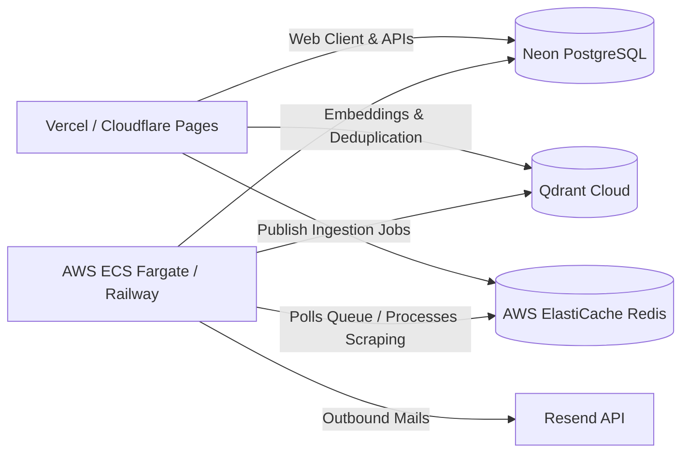

# Production & API Reference - FilterCoffee.ai

FilterCoffee.ai is a professional intelligence feed platform built as a unified Next.js application + BullMQ worker node. 

---

## 1. Local Development Sandbox

The project is pre-configured with a **zero-dependency fallback mode**. If Clerk, Stripe, Resend, or AI keys are set to `mock` in your `.env.local`, the platform automatically routes services to localized offline routines:

- **Database:** Local SQLite database file (`prisma/dev.db`).
- **Vector DB:** Local file-based vector cache (`prisma/vector_db.json`) running full cosine-similarity scans.
- **AI Embeddings:** Offline deterministic bag-of-words text vector generator.
- **AI Text Completion:** Rule-based heuristic briefing compiler producing detailed, formatted mock updates.
- **Billing:** Simulated checkout redirects (appending `?mock_checkout_success=true`) that interactively write upgraded limits directly to your local database.
- **Background Jobs:** Local asynchronous queue simulation utilizing standard JavaScript schedules.
- **Email:** Console logging output.

### Starting Dev Servers
1. Ensure dependencies are active:
   ```bash
   npm install
   ```
2. Sync the SQLite database:
   ```bash
   npx prisma db push
   ```
3. Run the Next.js development server:
   ```bash
   npm run dev
   ```
4. Access the dashboard at `http://localhost:3000/dashboard` (auto-logs you in as administrator `founder@filtercoffee.ai`).

---

## 2. API Route Registry (tRPC)

All routes are fully typed and accessible via client hooks (`trpc.<router>.<procedure>.useQuery/useMutation`).

### `trpc.signals` (Signals & Bookmarks)
- **`getSignals({ category, limit })`** `[Protected]`
  - *Input:* `{ category?: 'AI' | 'Finance' | 'Career' | 'General', limit?: number }`
  - *Returns:* Arrays of parsed signals + associated feed metadata.
- **`getBriefings()`** `[Protected]`
  - *Returns:* History list of Compiled Digests for the user.
- **`getTrends()`** `[Protected]`
  - *Returns:* Tri-pillar trend arrays (`career`, `finance`, `ai`).
- **`toggleBookmark({ title, url })`** `[Protected]`
  - *Input:* `{ title: string, url: string }`
  - *Returns:* `{ bookmarked: boolean }`
- **`getBookmarks()`** `[Protected]`
  - *Returns:* User's saved bookmark rows.

### `trpc.topics` (User Filter Subscriptions)
- **`getTopics()`** `[Protected]`
  - *Returns:* List of active topics + inclusive/exclusive keywords.
- **`createTopic({ name, frequency, includeKeywords, excludeKeywords })`** `[Protected]`
  - *Input:* `{ name: string, frequency: 'DAILY' | 'WEEKLY', includeKeywords: string[], excludeKeywords: string[] }`
  - *Returns:* Created Topic record. Enforces user subscription quota limits.
- **`updateTopic({ id, name, frequency, isActive })`** `[Protected]`
  - *Input:* `{ id: string, name: string, frequency: 'DAILY' | 'WEEKLY', isActive: boolean }`
  - *Returns:* Updated Topic.
- **`toggleTopicActive({ id })`** `[Protected]`
  - *Input:* `{ id: string }`
- **`deleteTopic({ id })`** `[Protected]`
  - *Input:* `{ id: string }`

### `trpc.billing` (Subscriptions Checkout)
- **`getSubscriptionStatus()`** `[Protected]`
  - *Returns:* `{ plan: 'FREE' | 'PRO' | 'POWER', status: string, maxTopics: number, activeTopicCount: number }`
- **`createCheckoutSession({ planCode })`** `[Protected]`
  - *Input:* `{ planCode: 'PRO' | 'POWER' }`
  - *Returns:* `{ url: string }` (Stripe checkout session redirect url).
- **`createPortalSession()`** `[Protected]`
  - *Returns:* `{ url: string }` (Stripe Customer Billing Portal redirect url).

### `trpc.admin` (System Operations)
- **`getMetrics()`** `[Admin]`
  - *Returns:* Database counts, system status, estimated API cost telemetry.
- **`getSources()`** `[Admin]`
  - *Returns:* Array of all registered RSS signals collectors.
- **`createSource({ name, url, type })`** `[Admin]`
  - *Input:* `{ name: string, url: string, type: 'AI' | 'Finance' | 'Career' | 'General' }`
- **`deleteSource({ id })`** `[Admin]`
  - *Input:* `{ id: string }`
- **`triggerManualIngestion()`** `[Admin]`
  - *Returns:* `{ success: true }`. Runs collection pipelines in background.
- **`triggerManualDigest({ userId })`** `[Admin]`
  - *Input:* `{ userId: string }`. Compiles and emails a digest immediately.
- **`getEmailLogs()`** `[Admin]`
  - *Returns:* 50 most recent transactional mail outcomes.
- **`getAuditLogs()`** `[Admin]`
  - *Returns:* 50 most recent admin action records.

---

## 3. Production Hosting Instructions



### Step 1: Database Migration (Neon PostgreSQL)
1. In your Neon console, create a PostgreSQL database.
2. In `prisma/schema.prisma`, change the datasource provider:
   ```prisma
   datasource db {
     provider = "postgresql"
     url      = env("DATABASE_URL")
   }
   ```
3. Run migrations against production database:
   ```bash
   DATABASE_URL="postgresql://..." npx prisma migrate deploy
   ```

### Step 2: Frontend Deployment (Vercel)
1. Push your repository to GitHub.
2. Connect the repository to **Vercel**.
3. Add environment variables from `.env.example` (Clerk keys, Stripe keys, Resend keys, OpenAI keys, Database URLs).
4. Deploy. Vercel automatically deploys the App Router routes and Next.js static pages.

### Step 3: Background Worker Deployment (AWS Fargate or Railway)
The background worker requires a persistent container state to process BullMQ tasks.
1. Build and publish your Docker worker image to AWS ECR:
   ```bash
   docker build -t filtercoffee-worker -f Dockerfile.worker .
   docker tag filtercoffee-worker:latest <ECR_URL>/filtercoffee-worker:latest
   docker push <ECR_URL>/filtercoffee-worker:latest
   ```
2. In AWS ECS, create a Fargate task definition utilizing the pushed ECR image.
3. Hook up the task environment variables pointing to your shared Neon Database URL and AWS ElastiCache Redis URL.
4. Scale the task to `1` replica to run processing loops continuously.
