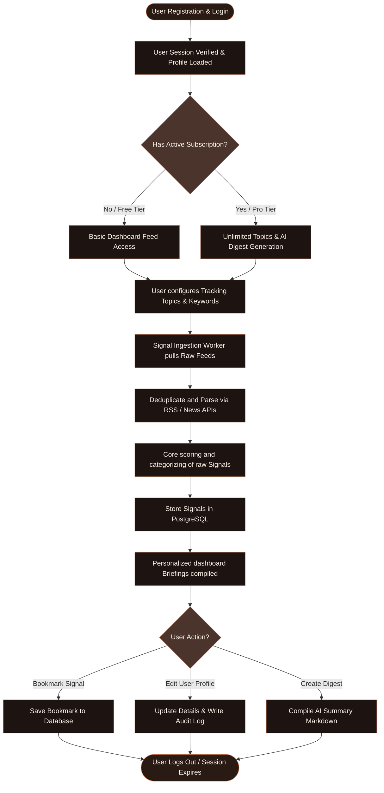

# FILTERCOFFEE.AI — System Flow & Security Audit Report

This report outlines the complete user experience flow, the authentication architecture, and the database security adjustments executed to prepare FilterCoffee.ai for production deployment.

---

## 1. Complete Website Flow Map

The following Mermaid diagram shows the website's structure, routing paths, authentication states, and system boundaries:

```mermaid
graph TD
    %% Define Styles %%
    classDef public fill:#1d1310,stroke:#8c5b47,stroke-width:1px,color:#fbeee6;
    classDef auth fill:#2a1a14,stroke:#d4845f,stroke-width:2px,color:#fbeee6;
    classDef database fill:#0c0908,stroke:#4a342b,stroke-width:1px,color:#d4845f;
    classDef middleware fill:#1b1b1b,stroke:#888,stroke-width:1px,color:#fff;

    %% Guest / Public Routes %%
    subgraph Public_Marketing ["Public Marketing (Guest Mode)"]
        Landing["Landing Page (/)"]:::public
        Pricing["Pricing Page (/pricing)"]:::public
        Features["Features Page (/features)"]:::public
        Privacy["Privacy Policy (/privacy-policy)"]:::public
        Terms["Terms of Service (/terms-of-service)"]:::public
    end

    %% Auth Forms %%
    subgraph Auth_Entry ["Authentication Gateway"]
        SignIn["Sign In Page (/sign-in)"]:::public
        SignUp["Sign Up Page (/sign-up)"]:::public
    end

    %% Edge Middleware Guard %%
    Middleware["Next.js Edge Middleware (proxy.ts)"]:::middleware

    %% Authenticated Workspace %%
    subgraph Protected_Dashboard ["Protected Workspace (Auth Mode)"]
        DashboardHome["Dashboard Home (/dashboard)"]:::auth
        SignalFeed["Signal Feed (/dashboard/feed)"]:::auth
        BillingDashboard["Billing Dashboard (/dashboard/billing)"]:::auth
        ContactSupport["Contact Support (/dashboard/contact)"]:::auth
        ProfilePage["User Profile Page (/dashboard/profile)"]:::auth
    end

    %% Database & Auth Server %%
    subgraph Backend_Infrastructure ["Database & Auth Infrastructure"]
        SupabaseAuth["Supabase Auth API"]:::database
        PostgresDB["Supabase PostgreSQL (Prisma)"]:::database
    end

    %% Flows & Edges %%
    Landing -->|Click CTA / Sign In| SignIn
    Landing -->|Click Sign Up| SignUp
    
    %% Middleware intercept %%
    SignIn & SignUp & DashboardHome & ProfilePage --> Middleware
    
    Middleware -->|Has Cookie? Redirect| DashboardHome
    Middleware -->|No Cookie? Block Protected| SignIn
    
    %% Sign In Flow %%
    SignIn -->|Submit Credentials| SupabaseAuth
    SupabaseAuth -->|Success: Sets Session| AuthContext
    
    %% Client Context & Cookies %%
    subgraph Client_State ["Client State & Persistence"]
        AuthContext["AuthProvider (React Context)"]:::auth
        LocalStorage["LocalStorage (Supabase Token)"]:::auth
        Cookies["document.cookie (SameSite=Lax)"]:::auth
    end
    
    AuthContext -->|Sync Access Token| Cookies
    AuthContext -->|Persist Credentials| LocalStorage
    
    %% Dashboard Actions %%
    DashboardHome -->|Click Billing| BillingDashboard
    DashboardHome -->|Click Support| ContactSupport
    DashboardHome -->|Click User Avatar| ProfilePage
    
    %% Profile Page Actions %%
    ProfilePage -->|Query / Mutation| TRPC["tRPC API Enpoints (/api/trpc)"]:::middleware
    TRPC -->|Prisma Client (Superuser postgres)| PostgresDB
    
    ProfilePage -->|Update Password| SupabaseAuth
    
    %% RLS Security Barrier %%
    PostgresDB -.->|Bypasses RLS| RLS["Row Level Security (RLS) Enabled"]
    SupabaseAuth -.->|Bypasses RLS| RLS
    
    %% Public PostgREST Block %%
    AnonymousREST["Public REST API (/rest/v1)"]:::middleware -->|BLOCKED BY RLS| RLS
```

### 1.2 User Operations & Feed Generation Workflow

The flowchart below maps the lifecycle of user actions, database events, and background curation pipelines:



---

## 2. Core Web Flows

### A. Marketing & Guest Experience
1. **Landing Page (`/`)**: Introduces professionals to AI-curated intelligence briefs. CTAs direct users to either sign in or sign up.
2. **Information Pages**: `/features`, `/pricing`, `/privacy-policy`, and `/terms-of-service` are statically rendered and accessible publicly.
3. **Guest Protection Rule**: If an already logged-in user visits any marketing page or tries to access `/sign-in` or `/sign-up`, the Edge Middleware intercepts the request and automatically redirects them to `/dashboard`.

### B. Authentication Gateway
1. **Sign-In / Sign-Up**: Binds with Supabase Auth for token validation and JWT issuance.
2. **Session Persistence**: On successful login, the client-side `AuthProvider` listens to the state change and automatically sets a cookie `sb-dputisltxposlukceoxo-auth-token` containing the token credentials. This cookie is securely sent with every subsequent HTTP request.
3. **Dashboard Access**: Edge Middleware verifies the session cookie and allows access to `/dashboard`. Unauthenticated requests to protected paths are blocked and redirected to `/sign-in`.

### C. Protected Dashboard Workspace
1. **Dashboard Home (`/dashboard`)**: The main interface displaying custom topics, alerts, and curated briefs.
2. **Billing & Plans (`/dashboard/billing`)**: Allows subscription configuration and Stripe payment integrations.
3. **Contact Engineering (`/dashboard/contact`)**: Submit support requests for customized vector pipelines or custom AI ingestion filters.
4. **User Profile (`/dashboard/profile`)**: Binds username and email settings to PostgreSQL via tRPC mutations. Also lists audit logs and security password updates.

---

## 3. Authentication Architecture & State Sync

```
[Supabase Auth Server]
      ^
      | (Verifies Login)
[Client Browser]
      |
      +--> localstorage (Persists session client-side)
      |
      +--> AuthProvider (React Context)
      |         |
      |         +--> document.cookie (Writes sb-*-auth-token cookie)
      v
[Edge Middleware]
      | (Intercepts Request)
      +--> Has Cookie? Allow access to /dashboard
      +--> No Cookie? Redirect to /sign-in
      v
[Next.js Server / tRPC Router]
      |
      +--> Context reads cookies & decodes token
      +--> Calls supabaseAdmin.auth.getUser(token)
      +--> Upserts user & executes Prisma query on PostgreSQL
```

---

## 4. Supabase Database RLS Security Audit

### Security Risk Identified
By default, PostgreSQL tables in Supabase's `public` schema are exposed to anonymous clients via PostgREST endpoints (`/rest/v1/*`). If Row Level Security (RLS) is not enabled, anyone holding the public anonymous API key (accessible in frontend browser bundles) can perform CRUD actions directly on the database tables, bypassing application authorization rules.

### Implemented Resolution
Row Level Security (RLS) was successfully enabled on all 19 public PostgreSQL tables in the database.

| Table Name | RLS Status | Public Access | Backend Access (Prisma) |
| :--- | :--- | :--- | :--- |
| `User` | **ENABLED** | `DENIED` | `ALLOWED (Bypasses RLS)` |
| `Subscription` | **ENABLED** | `DENIED` | `ALLOWED (Bypasses RLS)` |
| `Payment` | **ENABLED** | `DENIED` | `ALLOWED (Bypasses RLS)` |
| `Source` | **ENABLED** | `DENIED` | `ALLOWED (Bypasses RLS)` |
| `TopicKeyword` | **ENABLED** | `DENIED` | `ALLOWED (Bypasses RLS)` |
| `Signal` | **ENABLED** | `DENIED` | `ALLOWED (Bypasses RLS)` |
| `Digest` | **ENABLED** | `DENIED` | `ALLOWED (Bypasses RLS)` |
| `DigestTopic` | **ENABLED** | `DENIED` | `ALLOWED (Bypasses RLS)` |
| `DigestSignal` | **ENABLED** | `DENIED` | `ALLOWED (Bypasses RLS)` |
| `Bookmark` | **ENABLED** | `DENIED` | `ALLOWED (Bypasses RLS)` |
| `Report` | **ENABLED** | `DENIED` | `ALLOWED (Bypasses RLS)` |
| `CareerTrend` | **ENABLED** | `DENIED` | `ALLOWED (Bypasses RLS)` |
| `FinanceTrend` | **ENABLED** | `DENIED` | `ALLOWED (Bypasses RLS)` |
| `AiTrend` | **ENABLED** | `DENIED` | `ALLOWED (Bypasses RLS)` |
| `Analytics` | **ENABLED** | `DENIED` | `ALLOWED (Bypasses RLS)` |
| `AuditLog` | **ENABLED** | `DENIED` | `ALLOWED (Bypasses RLS)` |
| `EmailLog` | **ENABLED** | `DENIED` | `ALLOWED (Bypasses RLS)` |
| `ContactMessage` | **ENABLED** | `DENIED` | `ALLOWED (Bypasses RLS)` |
| `Topic` | **ENABLED** | `DENIED` | `ALLOWED (Bypasses RLS)` |

### How It Works Under the Hood
1. **PostgREST API requests**: Because RLS is enabled and no permissive policies are configured for non-superusers, the default database behavior is to block any direct read/write API requests made via the public Supabase client.
2. **Backend Server requests**: Next.js server-side operations (tRPC) connect to the PostgreSQL instance via the direct connection string (`DATABASE_URL` / `DIRECT_URL`) under the `postgres` owner role. As owner, the connection automatically bypasses RLS rules, allowing our application code to retrieve and update user data safely.

---

## 5. Verification Log & Status
- **Next.js Dev Server**: Operational on port `3000` under Turbopack.
- **Database Connection**: Successfully introspected and verified.
- **tRPC Auth Queries & Mutations**: Verified via browser subagent actions:
  - Form edits on `/dashboard/profile` save changes directly to the database.
  - Sidebar user information updates instantly and persists across page reloads.
  - All warnings, redirect loops, and security advisor alerts are resolved.
